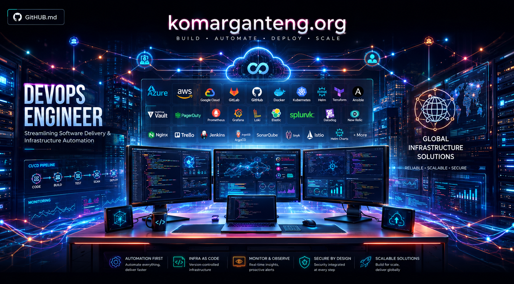

<p align="center">
  
</p>

# Komar

**DevOps Engineer** · Infrastructure & Platform Engineering

I build and operate containerized infrastructure, automate the repetitive
operational work around it, and turn recurring operational problems into tools.

`Build → Automate → Observe → Improve`

---

```text
komar@infra:~$ whoami --role
DevOps Engineer, moving toward platform engineering

komar@infra:~$ cat focus
Infrastructure · Cloud-native · Kubernetes · CI/CD · GitOps · Observability

komar@infra:~$ cat currently-building
Go tooling for infrastructure problems · terminal UIs · cloud-native utilities

komar@infra:~$ cat philosophy
Build it. Automate it. Observe it. Improve it.
```

<!-- STATUS:START -->
```text
─── ENGINEERING STATUS ─────────────────────────────────

  ROLE       DevOps Engineer -> Platform Engineering
  FOCUS      Infra · Cloud · K8s · CI/CD · GitOps · Observability
  BUILDING   bucket-explorer · cert-watch
  OPERATING  K3s · ArgoCD (GitOps) · Prometheus + Grafana · Cloudflare
  LEARNING   Kubernetes operators · internal developer platforms

  updated    2026-09-04 11:16 UTC — auto-refreshed by GitHub Actions

────────────────────────────────────────────────────────
```
<!-- STATUS:END -->

---

## What I do

- Build and operate containerized workloads on Kubernetes and K3s
- Design CI/CD pipelines and GitOps delivery — GitHub Actions, GitLab CI, ArgoCD
- Automate TLS, DNS, and edge routing with cert-manager, Let's Encrypt, and Cloudflare
- Provision infrastructure as code with Terraform
- Run observability with Prometheus and Grafana; load-test with k6
- Build internal tooling in Go for the operational problems that keep coming back
- Debug the infrastructure problems that surface at 3 AM, then remove the cause

## Infrastructure stack

Grouped by how much I actually lean on each tool, not by how it looks on a badge.

**Core — daily driver**
Linux · Bash · Docker · Kubernetes · K3s · GitHub Actions · GitLab CI · ArgoCD / GitOps · Prometheus · Grafana · Nginx · cert-manager · Cloudflare

**Working knowledge — used on real work, still deepening**
Terraform · AWS · Alibaba Cloud (ACK, OSS) · Google Cloud · PostgreSQL · Redis · Teleport · Portainer · k6 · S3-compatible object storage

**Actively learning — where I'm heading**
Go for infrastructure tooling and TUIs · Platform engineering · Kubernetes operators · Internal developer platforms

**Homelab — where I break things on purpose**
Proxmox · Ceph · k3sup · kube-vip · RustFS · Cloudflare Tunnel · end-to-end GitOps

## Featured work

### tui-todo-listapp — [repo](https://github.com/komarkun/tui-todo-listapp)
`Go · Bubble Tea · Bubbles · Lip Gloss`

A modal, keyboard-only terminal todo manager. Atomic JSON persistence so a crash
never corrupts state, layouts that reflow for tmux splits, and a self-collapsing
help system.

**Why:** a task list should live in the terminal, survive inside tmux, and need
no mouse and no account. It also exercises the same Bubble Tea toolkit the
infrastructure tools are built on.

### bucket-explorer — *private, opening gradually*
`Go · Bubble Tea · Lip Gloss · S3 API`

A terminal UI for S3-compatible object storage. One keyboard-driven interface
across AWS S3, DigitalOcean Spaces, Alibaba OSS, and RustFS: switch profiles,
browse buckets and objects, upload, download.

**Why:** routine object-storage work shouldn't mean logging into three different
cloud consoles for one operation. Demonstrates Go + TUI design + multi-provider
storage APIs applied to a real operational chore.

### cert-watch — *in design*
`Go · Bubble Tea · crypto/tls`

A terminal dashboard that checks TLS certificates across a domain list and sorts
them by urgency: healthy, warning, critical, expired.

**Why:** across many domains and hundreds of subdomains, the first sign of an
expired certificate is usually an outage. This turns a recurring operational
risk into a fast, reviewable view.

### Homelab — K3s + GitOps
`K3s · k3sup · kube-vip · ArgoCD · cert-manager · Prometheus · Grafana · Cloudflare`

A multi-node K3s cluster bootstrapped with k3sup and kube-vip, delivered end to
end through ArgoCD, with automatic TLS via cert-manager and Cloudflare, and
Prometheus/Grafana for visibility.

**Why:** the fastest way to understand a platform is to run one through its whole
lifecycle — provisioning, GitOps delivery, TLS automation, and observability.

## Engineering roadmap

```text
[x] Linux, networking, reverse proxies
[x] Docker and container workflows
[x] Kubernetes / K3s in production-style setups
[x] CI/CD pipelines — GitHub Actions, GitLab CI
[x] GitOps delivery with ArgoCD
[x] TLS automation — cert-manager, Let's Encrypt, Cloudflare
[x] Observability with Prometheus and Grafana
[x] Infrastructure as code with Terraform

[~] Go for infrastructure tooling and terminal UIs
[~] Platform engineering — abstractions over raw infrastructure
[~] Load and reliability testing with k6

[ ] Kubernetes operators / custom controllers
[ ] A small self-service internal developer platform
[ ] Regular open-source contributions
```

<!-- ACTIVITY:START -->
```text
─── RECENT PUBLIC ACTIVITY ─────────────────────────────

  2026-08-22   tui-todo-listapp       merged PR #1

────────────────────────────────────────────────────────
```
<!-- ACTIVITY:END -->

## How I work

- Infrastructure should be boring. If it isn't, automate it until it is.
- Security is an infrastructure concern, not a later phase — TLS, least
  privilege, and restricted access are part of the build, not a follow-up ticket.
- If a system can't be observed, it can't be operated. Metrics and alerts ship
  with the service.

## Elsewhere

- Site — [komarganteng.org](https://komarganteng.org)
- GitHub — [@komarkun](https://github.com/komarkun)

<sub>This profile is a small repository. The status and activity panels are rendered by a script — see <a href="docs/AUTOMATION.md">docs/AUTOMATION.md</a>.</sub>
